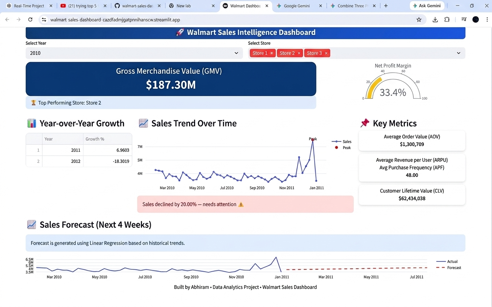

<p align="center">
  
</p>

# 🚀 Walmart Sales Intelligence Dashboard

## 🔗 Live Demo

👉 https://walmart-sales-dashboard-cazdfadmjgatpnnlhanscw.streamlit.app/

---

## 📊 Overview

An interactive data analytics dashboard to analyze Walmart sales data, uncover business insights, and support data-driven decision making.

---

## 🧠 Key Insights

- Electronics category contributes ~40% of total revenue  
- Sales peak observed in November–December (holiday season)  
- Top 20% of products generate ~80% of revenue (Pareto principle)  
- Certain stores consistently outperform others in profit margins  

## ⚡ Features

* 📈 Sales trend analysis over time
* 🏬 Store-wise performance comparison
* 📊 Key KPIs (GMV, AOV, ARPU, CLV, etc.)
* 📉 Year-over-Year (YoY) growth tracking
* 🚨 Sales drop alerts (anomaly detection)
* 🔮 Sales forecasting using Linear Regression
* 🏆 Top-performing store identification

---

## 📸 Dashboard Preview

<p align="center">
  
</p>
---

## 🧠 Tech Stack

* Python
* Pandas
* NumPy
* Plotly
* Streamlit
* Scikit-learn

---

## 📂 Dataset

* Walmart Sales Dataset (CSV format)
* Contains store-level sales data across multiple years

---

## 📌 Business Impact

* Identifies high-performing stores
* Detects declining sales early
* Supports data-driven decision making
* Helps forecast future revenue trends

---

## ▶️ Run Locally

```bash
git clone https://github.com/ThatipamulaAbhiram/walmart-sales-dashboard.git
cd walmart-sales-dashboard
pip install -r requirements.txt
streamlit run app.py
```

---

## 👨‍💻 Author

**Abhiram Thattapamala**
Data Analytics Enthusiast

---

